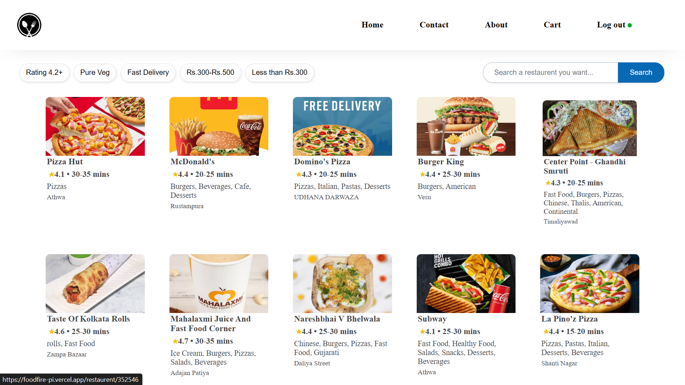

# [foodfire Live](https://foodfire-pi.vercel.app/)

## Table of content 📝

1. Features
2. Tech Stack
3. Getting Started
4. Understand Context Api

## 1. Features 🎯

<details><summary>1. Advanced Filters</summary>

</details>

<details><summary>2. Shimmer Effect</summary>

</details>

<details><summary>3. Fuzzy Search Bar</summary>

</details>

<details><summary>4. Responsive</summary>

</details>

## 2. Tech Stack

[](https://github.com/TSSumit/foodfire?tab=readme-ov-file#2-tech-stack)

1. ⚛️ **[ReactJS](https://react.dev/)** - A popular JavaScript library for building user interfaces, known for its component-based architecture and efficient rendering.
2. 💎 **[Formik](https://formik.org/)** - world's most popular open source form library for React and React Native.
3. Packages
   * [react-router-dom](https://reactrouter.com/web/guides/quick-start)
   * [react-icons](https://react-icons.github.io/react-icons/)

## 3. Getting Started ▶️

[](https://github.com/TSSumit/foodfire?tab=readme-ov-file#3-getting-started-%EF%B8%8F)

Follow these steps to set up and run the project on your local machine.

#### 1. Clone the Repository

[](https://github.com/TSSumit/foodfire?tab=readme-ov-file#1-clone-the-repository)

To get a local copy of this repository, run the following command in your terminal:

```shell
git clone https://github.com/TSSumit/foodfire.git
```

#### 2. Navigate to the Project

[](https://github.com/TSSumit/foodfire?tab=readme-ov-file#2-navigate-to-the-project)

Change your working directory to the project folder:

```shell
cd foodfire
```

#### 3. Install Dependencies

[](https://github.com/TSSumit/foodfire?tab=readme-ov-file#3-install-dependencies)

Install the required packages using npm:

```shell
npm install
```

#### 4. Start the Project

[](https://github.com/TSSumit/foodfire?tab=readme-ov-file#4-start-the-project)

Run the following command to launch the ReactJS project in your local environment:

```shell
npm start
```

#### 5. Access the Project

[](https://github.com/TSSumit/foodfire?tab=readme-ov-file#5-access-the-project)

Open your web browser and go to [http://localhost:3000](http://localhost:3000/) to view the project.

That's it! You're now ready to explore the project locally.
